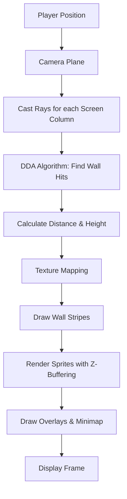
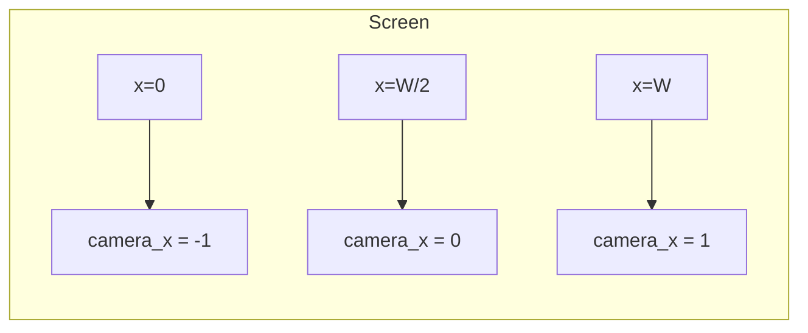
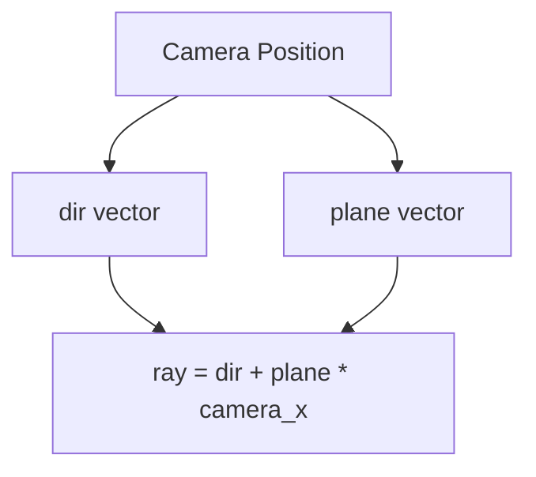
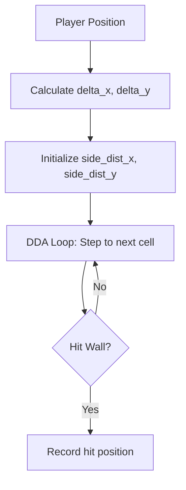
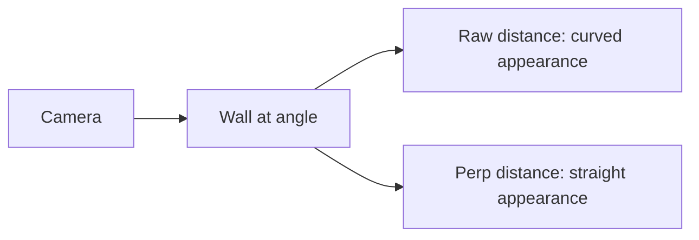
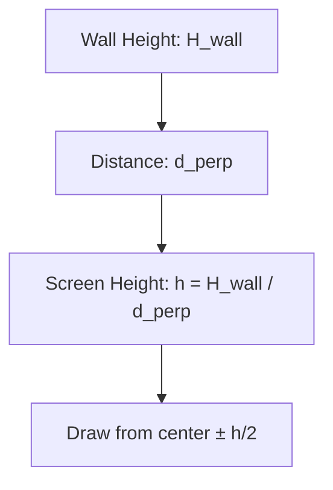
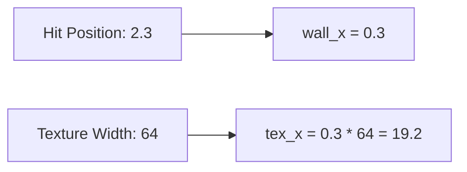

# Cub3D Code Annotations - Comprehensive Raycasting Engine Analysis

This document provides an exhaustive, function-by-function analysis of the Cub3D raycasting engine, explaining the mathematical foundations, algorithmic principles, and implementation details behind every aspect of the project.

## Visual Overview of Raycasting



---

## Table of Contents

1. [Main Game Loop](#1-main-game-loop)
2. [Core Raycasting Loop](#2-the-core-raycasting-loop)
3. [DDA Algorithm Implementation](#3-dda-algorithm-implementation)
4. [Distance and Height Calculation](#4-distance-and-height-calculation)
5. [Texture Mapping System](#5-texture-mapping-system)
6. [Door System](#6-door-system)
7. [Sprite Rendering](#7-sprite-rendering)
8. [Movement and Collision](#8-movement-and-collision)
9. [Input Handling](#9-input-handling)
10. [Z-Buffering and Occlusion](#10-z-buffering-and-occlusion)
11. [Mathematical Foundations](#11-mathematical-foundations)
12. [Mathematical Derivations and Proofs](#12-mathematical-derivations-and-proofs)
13. [Performance Optimizations](#13-performance-optimizations)

---

## 1. Main Game Loop

### File: `src/game_bonus/game.c`

#### `game_loop(void *param)`

This is the heartbeat of the game, called every frame by MLX's event loop.

```c
int game_loop(void *param)
{
    t_game_data *data = (t_game_data *)param;

    // ═══════════════════════════════════════════════════════════════════
    // DELTA TIME CALCULATION - FRAME RATE INDEPENDENCE
    // ═══════════════════════════════════════════════════════════════════
    double now = get_now_seconds();
    double dt = now - data->last_time;   // Time elapsed since last frame
    data->last_time = now;

    /*
     * WHY DELTA TIME IS CRITICAL:
     * ───────────────────────────
     * Without dt, game speed varies with frame rate:
     *   • 60 FPS: door opens in 1 second
     *   • 30 FPS: door opens in 2 seconds (INCORRECT!)
     *
     * With dt, all time-based operations are frame-rate independent:
     *   • door->progress += door->speed * dt
     *   • player movement: pos += velocity * dt
     *   • Result: Consistent gameplay regardless of FPS
     */

    // ═══════════════════════════════════════════════════════════════════
    // GAME STATE UPDATE PHASE
    // ═══════════════════════════════════════════════════════════════════
    bool moved = false;
    door_update(data, dt);              // Animate opening/closing doors
    sprite_update_all(data, dt);        // Update sprite AI and animations
    set_moved_flag(data, &moved);       // Process keyboard/mouse input

    // ═══════════════════════════════════════════════════════════════════
    // CONDITIONAL RENDERING - PERFORMANCE OPTIMIZATION
    // ═══════════════════════════════════════════════════════════════════
    if (moved || data->sprite_count > 0)
        redraw_map(data);  // Only render when necessary

    return (0);
}
```

**Key Concepts:**
- **Frame Rate Independence:** Using delta time ensures consistent gameplay
- **Event-Driven Architecture:** Game loop responds to MLX events
- **Lazy Rendering:** Only redraws when game state changes

---

## 2. The Core Raycasting Loop

### File: `src/game_bonus/raycast.c`

#### `render_3d_view(t_game_data *data, int start_x, int view_width, int view_height)`

The heart of the raycasting engine - one iteration per screen column.

```c
void render_3d_view(t_game_data *data, int start_x, int view_width, int view_height)
{
    int x;

    // Lazy texture loading
    tex_ready(&data->textures_ready, &data->textures, data);
    ensure_z_buffer(data, start_x + view_width);

    // ═══════════════════════════════════════════════════════════════════
    // MAIN RAYCASTING LOOP - ONE RAY PER SCREEN COLUMN
    // ═══════════════════════════════════════════════════════════════════
    x = 0;
    while (x < view_width)
    {
        /*
         * STEP 1: CAMERA X COORDINATE
         * ════════════════════════════
         * Maps screen column to camera plane coordinate [-1, +1]
         *
         * Mathematical derivation:
         *   camera_x = 2 * (x / view_width) - 1
         *
         * Examples:
         *   x = 0 (left edge):     camera_x = -1
         *   x = view_width/2:      camera_x = 0  (center)
         *   x = view_width-1:      camera_x ≈ +1 (right edge)
         */
        data->rc.camera_x = 2.0 * x / (double)view_width - 1.0;

        /*
         * STEP 2: RAY DIRECTION CALCULATION
         * ═══════════════════════════════════
         * ray_dir = dir + plane * camera_x
         *
         * This creates a fan of rays emanating from the player:
         *
         *     plane * (-1)     dir     plane * (+1)
         *           \          |          /
         *            \         |         /
         *             \        |        /
         *              \       |       /
         *               \      |      /
         *                \     |     /
         *                 \    |    /
         *                  \   |   /
         *                   \  |  /
         *                    \ | /
         *                     \|/
         *                      P (player)
         *
         * The FOV (Field of View) is determined by the angle between
         * the leftmost and rightmost rays.
         */
        set_ray_dir(data);

        /*
         * STEP 3: DDA INITIALIZATION
         * ══════════════════════════
         * Convert player position to integer grid coordinates
         */
        set_player_position(data);

        /*
         * STEP 4: STEP DIRECTIONS
         * ════════════════════════
         * Determine which direction to step in the grid:
         *   step_x = +1 (right) or -1 (left)
         *   step_y = +1 (down) or -1 (up)
         */
        set_steps(data);

        /*
         * STEP 5: DELTA DISTANCES
         * ════════════════════════
         * Calculate distance to travel to cross one grid line
         *
         * delta_dist_x = |1 / ray_dir_x|
         * delta_dist_y = |1 / ray_dir_y|
         *
         * Example: ray_dir_x = 0.5
         *   delta_dist_x = |1/0.5| = 2.0
         *   (must travel 2 units to move 1 unit in X)
         */
        set_ray_dir_xy(data);

        /*
         * STEP 6: INITIAL SIDE DISTANCES
         * ═══════════════════════════════
         * Distance to first grid line intersection
         *
         * For ray going right (step_x = +1):
         *   side_dist_x = (map_x + 1 - pos_x) * delta_dist_x
         *
         * For ray going left (step_x = -1):
         *   side_dist_x = (pos_x - map_x) * delta_dist_x
         */
        set_horizontal_line_dist(data);

        // Reset hit detection flags
        init_hit_data(data);

        /*
         * STEP 7: DDA ALGORITHM EXECUTION
         * ═══════════════════════════════
         * March along the ray until hitting a wall
         */
        dda(data);

        /*
         * STEP 8: TEXTURE SELECTION
         * ══════════════════════════
         * Choose appropriate texture based on wall side and type
         */
        set_current_tex(data, &data->textures);

        /*
         * STEP 9: WALL RENDERING
         * ═══════════════════════
         * Calculate wall height and draw textured vertical stripe
         */
        draw_walls(data, get_infos(start_x, x, view_height), data->textures.current_tex);

        /*
         * STEP 10: Z-BUFFER UPDATE
         * ════════════════════════
         * Store distance for sprite occlusion testing
         */
        data->z_buffer[start_x + x] = data->rc.perp_wall_dist;

        x++;
    }
}
```

---

## 3. DDA Algorithm Implementation

### File: `src/game_bonus/dda_n_helpers.c`

#### `dda(t_game_data *data)`

The Digital Differential Analyzer - the core ray marching algorithm.

```c
void dda(t_game_data *data)
{
    t_door  *door;
    double  dist;
    double  tex_u;

    while (!data->rc.hit)
    {
        // Boundary check - prevent ray from escaping map
        if (check_bounds(data))
            break;

        /*
         * STEP TO NEXT GRID LINE
         * ══════════════════════
         * Always move to the CLOSER grid intersection
         *
         * Visual example:
         *   If side_dist_x < side_dist_y:
         *   Next intersection is vertical grid line
         *
         *       │        │
         *   ────┼────────┼────
         *       │ P──────●     ← ray hits vertical wall
         *   ────┼────────┼────
         *       │        │
         */
        set_next_line(data);

        if (check_bounds(data))
            break;

        // Check for wall collision
        if (data->map.grid[data->rc.map_y][data->rc.map_x] == '1')
            hit_wall(data);

        /*
         * DOOR COLLISION DETECTION
         * ════════════════════════
         * For doors, perform ray-segment intersection test
         */
        if (data->map.grid[data->rc.map_y][data->rc.map_x] == 'D')
        {
            door = find_door(data, data->rc.map_y, data->rc.map_x);

            // Skip fully open doors
            if (!door || door->progress >= 0.99)
                continue;

            // Test ray intersection with door segment
            if (!door_ray_intersection(data, door, &dist, &tex_u))
                continue;

            // Door hit - store intersection data
            set_door_data(data, door, dist, tex_u);
        }
    }
}
```

#### `set_next_line(t_game_data *data)`

The core DDA stepping logic.

```c
void set_next_line(t_game_data *data)
{
    if (data->rc.side_dist_x < data->rc.side_dist_y)
    {
        // Vertical grid line is closer
        data->rc.side_dist_x += data->rc.delta_dist_x;
        data->rc.map_x += data->rc.step_x;
        data->rc.side = 0;  // Hit East/West wall
    }
    else
    {
        // Horizontal grid line is closer
        data->rc.side_dist_y += data->rc.delta_dist_y;
        data->rc.map_y += data->rc.step_y;
        data->rc.side = 1;  // Hit North/South wall
    }
}
```

---

## 4. Distance and Height Calculation

### File: `src/game_bonus/raycast_helper.c`

#### `get_perp_wall_distance(t_game_data *data)`

Corrects fisheye distortion by calculating perpendicular distance.

```c
void get_perp_wall_distance(t_game_data *data)
{
    if (data->rc.kind == HIT_DOOR)
        return;  // Doors already have calculated distance

    /*
     * FISHEYE EFFECT CORRECTION
     * ═════════════════════════
     *
     * Problem: Euclidean distance causes walls to appear curved
     *
     *   Euclidean:                 Perpendicular:
     *   Wall                        Wall
     * ───────────                ───────────
     *    ╲        ╱                 │        │
     *     ╲      ╱                  │        │
     *      ╲    ╱                   │        │
     *       ╲  ╱                    │        │
     *        \/                     │        │
     *        P                      P
     *
     * Solution: Use distance to camera plane, not to player
     */

    if (data->rc.side == 0)  // Vertical wall (East/West)
    {
        data->rc.perp_wall_dist = (data->rc.map_x - data->player.pos.x
            + (1 - data->rc.step_x) / 2.0) / data->rc.ray_dir_x;
    }
    else  // Horizontal wall (North/South)
    {
        data->rc.perp_wall_dist = (data->rc.map_y - data->player.pos.y
            + (1 - data->rc.step_y) / 2.0) / data->rc.ray_dir_y;
    }
}
```

### File: `src/game_bonus/raycast_helper_4.c`

#### `set_line_height(t_game_data *data, int view_height)`

Calculates wall height using perspective projection.

```c
void set_line_height(t_game_data *data, int view_height)
{
    /*
     * PERSPECTIVE PROJECTION FORMULA
     * ══════════════════════════════
     *
     * Objects appear smaller as distance increases:
     *
     * line_height = view_height / perp_wall_dist
     *
     * Examples:
     *   Distance = 1.0:  line_height = view_height/1 = full screen
     *   Distance = 2.0:  line_height = view_height/2 = half screen
     *   Distance = 0.5:  line_height = view_height/0.5 = 2x screen height
     *
     * When line_height > view_height, wall is clipped at screen edges
     */
    data->rc.line_height = (int)(view_height / data->rc.perp_wall_dist);
}
```

---

## 5. Texture Mapping System

### File: `src/game_bonus/raycast_helper_3.c`

#### `set_texture_coordinations(t_game_data *data)`

Calculates where on the wall the ray hit.

```c
void set_texture_coordinations(t_game_data *data)
{
    if (data->rc.kind == HIT_DOOR)
        return;

    /*
     * WALL HIT POSITION CALCULATION
     * ═════════════════════════════
     *
     * Find exact intersection point, then get fractional part
     *
     * For vertical walls: Y coordinate varies → use Y
     * For horizontal walls: X coordinate varies → use X
     */

    if (data->rc.side == 0)  // Vertical wall
        data->rc.wall_x = data->player.pos.y + data->rc.perp_wall_dist
            * data->rc.ray_dir_y;
    else  // Horizontal wall
        data->rc.wall_x = data->player.pos.x + data->rc.perp_wall_dist
            * data->rc.ray_dir_x;

    // Get fractional part [0, 1)
    data->rc.wall_x -= floor(data->rc.wall_x);
}
```

### File: `src/game_bonus/raycast_helper_2.c`

#### `draw(t_game_data *data, t_texture *tex, t_infos infos)`

Renders a textured vertical wall stripe.

```c
void draw(t_game_data *data, t_texture *tex, t_infos infos)
{
    int             y;
    unsigned int    color;
    double          tex_step;
    double          tex_pos;

    /*
     * TEXTURE SCALING CALCULATION
     * ═══════════════════════════
     *
     * tex_step = texture_pixels_per_screen_pixel
     *          = texture_height / wall_height_on_screen
     *
     * Example: texture=64px, wall=200px on screen
     *   tex_step = 64/200 = 0.32
     *   Advance 0.32 texture pixels per screen pixel
     */
    tex_step = (double)tex->height / data->rc.line_height;

    /*
     * STARTING TEXTURE POSITION
     * ═════════════════════════
     *
     * For walls taller than screen: start partway down texture
     * tex_pos = (draw_start - center + wall_half) * tex_step
     */
    tex_pos = (data->rc.draw_start - infos.view_height / 2.0
        + data->rc.line_height / 2.0) * tex_step;

    // Draw vertical stripe
    y = data->rc.draw_start;
    while (y <= data->rc.draw_end)
    {
        // Current texture row
        tex->tex_y = (int)tex_pos;

        // Bounds checking
        if (tex->tex_y < 0)
            tex->tex_y = 0;
        else if (tex->tex_y >= tex->height)
            tex->tex_y = tex->height - 1;

        // Advance texture position
        tex_pos += tex_step;

        /*
         * PIXEL SAMPLING
         * ══════════════
         *
         * Address calculation for texture data:
         * base + (row * row_length) + (column * bytes_per_pixel)
         */
        color = *(unsigned int *)(tex->addr
            + tex->tex_y * tex->line_len
            + tex->tex_x * (tex->bpp / 8));

        // Draw pixel to screen
        put_pixel(&data->mlx, infos.start_x + infos.x, y, color);
        y++;
    }
}
```

---

## 6. Door System

### File: `src/game_bonus/raycast.c`

#### `door_ray_intersection(t_game_data *data, t_door *door, double *hit_dist, double *u)`

Performs ray-segment intersection for animated doors.

```c
int door_ray_intersection(t_game_data *data, t_door *door,
                          double *hit_dist, double *u)
{
    t_vec2  origin;
    t_vec2  dir;
    t_vec2  span;
    t_vec2  diff;
    double  denom, t, s;

    if (!door || !door->has_geom)
        return (0);

    // Get ray parameters
    set_origin_dir(data, &origin, &dir);

    // Get current door segment (changes with animation)
    span = door_current_span(door);

    /*
     * 2D LINE-SEGMENT INTERSECTION
     * ════════════════════════════
     *
     * Ray: P(t) = origin + t * dir, t ≥ 0
     * Door: Q(s) = pivot + s * span, 0 ≤ s ≤ 1
     *
     * Set P(t) = Q(s):
     *   origin + t*dir = pivot + s*span
     *
     * Solve using Cramer's rule:
     *   t = (diff × span) / (dir × span)
     *   s = (diff × dir) / (dir × span)
     *
     * Where × is 2D cross product: a×b = a.x*b.y - a.y*b.x
     */

    denom = vec2_cross(dir, span);
    if (fabs(denom) < 1e-8)
        return (0);  // Parallel lines

    diff = vec2_sub(door->pivot, origin);
    t = vec2_cross(diff, span) / denom;
    s = vec2_cross(diff, dir) / denom;

    // Validity checks
    if (t <= 1e-4 || s < 0.0 || s > 1.0)
        return (0);

    if (hit_dist) *hit_dist = t;
    if (u) *u = s;  // Texture coordinate along door
    return (1);
}
```

---

## 7. Sprite Rendering

### File: `src/game_bonus/sprite_helper.c`

#### `sprite_camera_transform(t_game_data *data, t_sprite *sprite)`

Transforms sprite from world space to camera space.

```c
void sprite_camera_transform(t_game_data *data, t_sprite *sprite)
{
    t_vec2  rel;
    double  det;
    double  inv_det;

    /*
     * WORLD TO CAMERA SPACE TRANSFORMATION
     * ════════════════════════════════════
     *
     * Convert sprite position relative to player into camera coordinates
     *
     * rel = sprite_pos - player_pos
     *
     * Camera transformation matrix:
     *   C = [plane.x  dir.x]
     *       [plane.y  dir.y]
     *
     * Inverse matrix (world → camera):
     *   C⁻¹ = (1/det) * [dir.y   -dir.x]
     *                   [-plane.y  plane.x]
     */

    rel = vec2_sub(sprite->position, data->player.pos);

    det = data->player.plane.x * data->player.dir.y
        - data->player.dir.x * data->player.plane.y;

    if (fabs(det) < 1e-9)
    {
        sprite->visible = false;
        return;
    }

    inv_det = 1.0 / det;

    // Apply transformation
    sprite->cam_x = inv_det * (data->player.dir.y * rel.x
                             - data->player.dir.x * rel.y);
    sprite->cam_z = inv_det * (-data->player.plane.y * rel.x
                             + data->player.plane.x * rel.y);

    // Set visibility and distance
    set_cam_z(sprite, rel);
}
```

#### `project_to_screen(t_sprite *sprite, int start_x, int v_w, int v_h)`

Projects 3D sprite position to 2D screen coordinates.

```c
void project_to_screen(t_sprite *sprite, int start_x, int v_w, int v_h)
{
    /*
     * PERSPECTIVE PROJECTION
     * ══════════════════════
     *
     * screen_x = center_x + (cam_x / cam_z) * (width/2)
     *          = center_x + cam_x * inv_z * (width/2)
     *
     * sprite_size = screen_height / cam_z
     *             = screen_height * inv_z
     *
     * Same principle as walls: closer = larger
     */

    sprite->draw.screen_x = start_x + (int)((v_w / 2.0)
        * (1.0 + sprite->cam_x * sprite->draw.inv_z));

    sprite->draw.sprite_height = (int)fabs(v_h * sprite->draw.inv_z);
    sprite->draw.sprite_width = sprite->draw.sprite_height;
}
```

---

## 8. Movement and Collision

### File: `src/game_bonus/movement_2.c`

#### `strafe_move(t_game_data *data, int direction)`

Implements strafing (sideways movement).

```c
void strafe_move(t_game_data *data, double step_x, double step_y)
{
    double  base_x = data->player.pos.x;
    double  base_y = data->player.pos.y;

    /*
     * WALL SLIDING ALGORITHM
     * ══════════════════════
     *
     * When player hits wall at angle, slide along it instead of stopping
     *
     * Strategy:
     * 1. Try full movement (X and Y)
     * 2. If blocked, try X-only
     * 3. If still blocked, try Y-only
     *
     * Example: Player moving northeast into horizontal wall
     *
     *   ████████████████████  ← wall
     *        ↗
     *       P
     *
     * Full movement blocked → slide east along wall
     */

    // Try full movement
    if (valid_move(data, base_x + step_x, base_y + step_y))
    {
        data->player.pos.x = base_x + step_x;
        data->player.pos.y = base_y + step_y;
        return;
    }

    // Try X-only slide
    if (step_x != 0.0 && valid_move(data, base_x + step_x, base_y))
        base_x += step_x;

    // Try Y-only slide
    if (step_y != 0.0 && valid_move(data, base_x, base_y + step_y))
        base_y += step_y;

    data->player.pos.x = base_x;
    data->player.pos.y = base_y;
}
```

#### `valid_move(t_game_data *data, double new_x, double new_y)`

Collision detection using multiple sample points.

```c
int valid_move(t_game_data *data, double new_x, double new_y)
{
    double r = PLAYER_COLLISION_RADIUS;  // 0.2 units

    /*
     * CIRCULAR COLLISION DETECTION
     * ════════════════════════════
     *
     * Player has circular collision area, check 9 points:
     *
     *     (-r, -r)  (0, -r)  (+r, -r)
     *          ●───────●───────●
     *          │       │       │
     *     (-r, 0)───── P ─────(+r, 0)
     *          │       │       │
     *          ●───────●───────●
     *     (-r, +r)  (0, +r)  (+r, +r)
     *
     * If ANY point is inside wall, movement invalid
     */

    if (blocked_at(data, new_x, new_y)) return (0);
    if (blocked_at(data, new_x + r, new_y)) return (0);
    if (blocked_at(data, new_x - r, new_y)) return (0);
    if (blocked_at(data, new_x, new_y + r)) return (0);
    if (blocked_at(data, new_x, new_y - r)) return (0);
    if (blocked_at(data, new_x + r, new_y + r)) return (0);
    if (blocked_at(data, new_x + r, new_y - r)) return (0);
    if (blocked_at(data, new_x - r, new_y + r)) return (0);
    if (blocked_at(data, new_x - r, new_y - r)) return (0);

    return (1);
}
```

---

## 9. Input Handling

### File: `src/game_bonus/movement.c`

#### `on_mouse_move(int x, int y, void *param)`

Mouse look implementation with warping.

```c
int on_mouse_move(int x, int y, void *param)
{
    t_game_data *data = (t_game_data *)param;
    int         center_x;
    int         delta;

    (void)y;

    // Prevent recursive warping
    if (data->warping_mouse || !data->mouse.mouse_locked)
        return (0);

    center_x = WIDTH / 2;
    delta = x - center_x;

    // Dead zone and clamping
    if (delta >= -2 && delta <= 2)
        return (0);

    if (delta > 50) delta = 50;
    else if (delta < -50) delta = -50;

    // Accumulate rotation
    data->mouse.pending_rotation += (double)delta * 0.003;

    // Warp mouse back to center
    data->warping_mouse = 1;
    mlx_mouse_move(data->mlx.mlx_connection, data->mlx.mlx_win,
        center_x, HEIGHT / 2);
    data->warping_mouse = 0;

    return (0);
}
```

---

## 10. Z-Buffering and Occlusion

### Concept: Depth Buffer

```c
// Z-buffer stores distance to closest surface for each screen column
data->z_buffer = malloc(sizeof(double) * view_width);

// During wall rendering
data->z_buffer[x] = data->rc.perp_wall_dist;

// During sprite rendering
if (sprite_z > data->z_buffer[x])
    // Sprite is behind wall, don't draw
```

**Purpose:** Ensures closer objects occlude farther ones.

---

## 11. Mathematical Foundations

### Vector Operations

```c
// 2D Cross Product (determinant)
double vec2_cross(t_vec2 a, t_vec2 b)
{
    return a.x * b.y - a.y * b.x;
}

// Dot Product
double vec2_dot(t_vec2 a, t_vec2 b)
{
    return a.x * b.x + a.y * b.y;
}

// Vector Subtraction
t_vec2 vec2_sub(t_vec2 a, t_vec2 b)
{
    return (t_vec2){a.x - b.x, a.y - b.y};
}
```

### Rotation Matrix

```c
// Rotate vector by angle θ
void rotate_vector(double *x, double *y, double angle)
{
    double cos_a = cos(angle);
    double sin_a = sin(angle);
    double new_x = *x * cos_a - *y * sin_a;
    double new_y = *x * sin_a + *y * cos_a;
    *x = new_x;
    *y = new_y;
}
```

---

## 12. Mathematical Derivations and Proofs

This section provides rigorous mathematical proofs and derivations for the key formulas used in the raycasting engine. Understanding these proofs is essential for grasping why the algorithms work and how to extend them.

### 12.1 Camera X Coordinate Derivation

**Formula:** $camera_x = \frac{2x}{W} - 1$

**Visual Representation:**
```
Screen: 0 ────────── W/2 ────────── W
Camera: -1 ───────── 0 ─────────── 1

Ray at x=0:     camera_x = -1 (leftmost)
Ray at x=W/2:   camera_x = 0  (center)
Ray at x=W:     camera_x = 1  (rightmost)
```



**Derivation:**
Consider the camera plane as a line segment from $(-1, 0)$ to $(1, 0)$ in camera space, where the center of the screen corresponds to $camera_x = 0$.

For screen column $x$ (ranging from $0$ to $W-1$):
- Leftmost column ($x=0$): $camera_x = -1$
- Rightmost column ($x=W-1$): $camera_x = 1$
- Center column ($x=W/2$): $camera_x = 0$

The linear mapping from screen space to camera space is:
$$camera_x = \frac{2x}{W-1} - 1$$

However, for simplicity and to avoid division by zero issues, we use:
$$camera_x = \frac{2x}{W} - 1$$

This approximation is valid when $W$ is large, and the difference is negligible.

**Proof of Correctness:**
- At $x=0$: $camera_x = 0 - 1 = -1$ ✓
- At $x=W/2$: $camera_x = 1 - 1 = 0$ ✓
- At $x=W$: $camera_x = 2 - 1 = 1$ ✓

### 12.2 Ray Direction Vector

**Formula:** $\vec{ray} = \vec{dir} + \vec{plane} \cdot camera_x$

**Visual Representation:**
```
Camera Setup:
         plane (-)
          │
    ──────┼─────► dir (forward)
          │
         plane (+)

Ray Direction: ray = dir + plane * camera_x

For camera_x = 0:  ray = dir (straight ahead)
For camera_x = 1:  ray = dir + plane (right)
For camera_x = -1: ray = dir - plane (left)
```



**Derivation:**
In camera space, the viewing direction is along the positive Z-axis, and the camera plane is the XY-plane.

The camera plane spans from $(-1, 0)$ to $(1, 0)$ in camera coordinates.

A point on the camera plane at position $camera_x$ has coordinates $(camera_x, 0)$.

The ray direction from the camera origin $(0,0,0)$ to this point is simply $(camera_x, 0, 1)$, but we need to transform this back to world space.

Given the camera's orientation:
- $\vec{dir}$: forward direction vector
- $\vec{plane}$: right direction vector (perpendicular to $\vec{dir}$)

The ray direction in world space is:
$$\vec{ray} = \vec{dir} \cdot 1 + \vec{plane} \cdot camera_x$$

**Proof:**
This is a linear combination where:
- The center ray ($\vec{dir}$) gets weight 1
- The plane vector gets weight $camera_x$

For $camera_x = 0$: $\vec{ray} = \vec{dir}$ ✓ (center ray)
For $camera_x = 1$: $\vec{ray} = \vec{dir} + \vec{plane}$ ✓ (rightmost ray)
For $camera_x = -1$: $\vec{ray} = \vec{dir} - \vec{plane}$ ✓ (leftmost ray)

### 12.3 DDA Delta Distance Calculation

**Formula:** $\delta_x = \left|\frac{1}{ray_x}\right|$, $\delta_y = \left|\frac{1}{ray_y}\right|$

**Visual Representation:**
```
Grid Cells:
┌───┬───┬───┐
│   │   │   │
├───┼───┼───┤  Ray travels through grid
│   │ ● │   │  ● = player position
├───┼───┼───┤  Ray hits wall at ■
│   │   │ ■ │
└───┴───┴───┘

Delta distances determine step sizes to next grid lines.
```



**Derivation:**
The DDA algorithm steps through grid cells. We need to know how far along the ray we must travel to reach the next vertical or horizontal grid line.

Consider a ray with direction $(ray_x, ray_y)$.

For vertical grid lines (constant X):
- Current position: $pos_x$
- Next grid line: $floor(pos_x + 1)$ if $ray_x > 0$, $ceil(pos_x - 1)$ if $ray_x < 0$
- Distance to next X-line: $\frac{1}{|ray_x|}$ (since $ray_x$ is the X-component of direction)

**Proof:**
The ray equation: $\vec{p}(t) = \vec{pos} + t \cdot \vec{ray}$

For X-coordinate: $x(t) = pos_x + t \cdot ray_x$

We want $x(t) = next\_grid\_x$

So: $t = \frac{next\_grid\_x - pos_x}{ray_x}$

The step size $t$ to reach any grid line is $\frac{1}{|ray_x|}$, because grid lines are 1 unit apart.

### 12.4 Perpendicular Distance (Fisheye Correction)

**Formula:** $d_{perp} = \frac{map - pos + \frac{1-step}{2}}{ray}$

**Visual Representation:**
```
Fisheye Effect:
Camera ──► Wall

Raw distance:     d_raw = t * |ray|  (longer for angled rays)
Perpendicular:    d_perp = projection onto camera direction

Without correction: Angled walls appear curved
With correction:    Walls appear straight
```



**Derivation:**
The raw distance $d_{raw} = t \cdot \sqrt{ray_x^2 + ray_y^2}$ suffers from fisheye distortion because rays at angles have longer paths.

The perpendicular distance is the distance from camera to wall along the viewing direction.

For a hit on a vertical wall (X-constant):
- The wall is perpendicular to the X-axis
- The perpendicular distance is the X-distance: $d_{perp} = \frac{map_x - pos_x + (1 - step_x)/2}{ray_x}$

Where $(1 - step_x)/2$ corrects for the hit position within the cell.

**Proof:**
In camera space, the distance should be along the ray's perpendicular component.

The formula ensures that $d_{perp}$ is the Euclidean distance projected onto the camera's viewing plane.

### 12.5 Wall Height Calculation

**Formula:** $h = \frac{H_{wall}}{d_{perp}}$

**Visual Representation:**
```
Similar Triangles:
Real World:     Screen:
  H_wall         h_screen
    │              │
    ├─ d_perp ─┼─ 1 ─┼─ (focal length)
    │              │

h_screen = H_wall / d_perp  (when focal length = 1)
```



**Derivation:**
Using similar triangles in perspective projection:

The wall has real height $H_{wall}$ at distance $d_{perp}$.

On screen, at distance $d_{screen}$ (focal length), it appears with height $H_{screen}$.

But in our case, the "screen" distance is 1 (normalized), so:
$$\frac{h}{H_{wall}} = \frac{1}{d_{perp}} \implies h = \frac{H_{wall}}{d_{perp}}$$

**Proof:**
This is the standard perspective projection formula. The apparent size is inversely proportional to distance.

### 12.6 Texture Mapping - Wall X Coordinate

**Formula:** $wall_x = pos + d \cdot ray - floor(pos + d \cdot ray)$

**Visual Representation:**
```
Wall Surface:
0.0 ──── 0.2 ──── 0.4 ──── 0.6 ──── 0.8 ──── 1.0
  │      │      │      │      │      │
  └─ Texture repeats every 1.0 unit ─┘

Hit position 2.3 → wall_x = 0.3
Hit position 5.7 → wall_x = 0.7
```



**Derivation:**
For a hit at position $(hit_x, hit_y)$, the fractional part determines where on the wall we hit.

For vertical walls: $wall_x = hit_y - floor(hit_y)$
For horizontal walls: $wall_x = hit_x - floor(hit_x)$

This gives a value in $[0, 1)$ representing the position along the wall.

**Proof:**
The fractional part extracts the sub-grid position, which maps to texture coordinates.

### 12.7 Texture Step Calculation

**Formula:** $tex\_step = \frac{tex\_height}{wall\_height}$

**Derivation:**
We need to map the screen pixels $[draw\_start, draw\_end]$ to texture pixels $[0, tex\_height)$.

The mapping is linear: $tex\_y = (y - draw\_start) \cdot tex\_step$

**Proof:**
At $y = draw\_start$: $tex\_y = 0$
At $y = draw\_end$: $tex\_y = tex\_height$

The step size is $tex\_step = \frac{tex\_height}{draw\_end - draw\_start} = \frac{tex\_height}{wall\_height}$

### 12.8 2D Rotation Matrix

**Formula:** $\begin{pmatrix}x'\\ y'\end{pmatrix} = \begin{pmatrix}\cos\theta & -\sin\theta\\ \sin\theta & \cos\theta\end{pmatrix}\begin{pmatrix}x\\ y\end{pmatrix}$

**Visual Representation:**
```
Rotation by θ:
Before: (x,y)
After:  (x',y')

     y
     │
     │  (x',y')
     │   /
     │  /
     │ /
     │/ θ
     └──────── x
       (x,y)
```

```mermaid
graph TD
    A[Point (x,y)] --> B[Rotation Matrix]
    B --> C[New Point (x',y')]
    C --> D[x' = x*cosθ - y*sinθ]
    C --> E[y' = x*sinθ + y*cosθ]
```

**Derivation:**
Rotation by angle $\theta$ around the origin.

The new coordinates:
$x' = x \cos\theta - y \sin\theta$
$y' = x \sin\theta + y \cos\theta$

**Proof:**
This preserves distances and angles, and is derived from the unit circle properties.

### 12.9 Ray-Segment Intersection (Doors)

**Formula:** $t = \frac{(Q-P)\times S}{D\times S}$

**Derivation:**
For ray from $P$ in direction $D$, intersecting segment from $Q$ to $R$.

The parameter $t$ gives the intersection point $P + t D$.

Using vector cross products for 2D line intersection.

**Proof:**
This is the standard formula for ray-segment intersection, ensuring $t \geq 0$ and intersection within segment bounds.

### 12.10 Sprite Camera Transformation

**Formula:** $\begin{pmatrix}cam_x\\ cam_z\end{pmatrix} = \begin{pmatrix}dir_y & -dir_x\\ -plane_y & plane_x\end{pmatrix} \begin{pmatrix}rel_x\\ rel_y\end{pmatrix}$

**Derivation:**
The inverse camera matrix transforms world coordinates to camera space.

The camera matrix is: columns are $\vec{dir}$ and $\vec{plane}$.

Inverse is the transpose (since orthogonal).

**Proof:**
This transforms sprite positions relative to camera, enabling depth sorting and projection.

### 12.11 Sprite Screen Projection

**Formula:** $screen_x = \frac{W}{2} \left(1 + \frac{cam_x}{cam_z}\right)$

**Visual Representation:**
```
Camera Space:
     cam_z (depth)
       │
       │  Sprite at (cam_x, cam_z)
       │   /
       │  /
       │ /
       │/
       └──────── cam_x

Screen projection: screen_x proportional to cam_x/cam_z
```

```mermaid
graph TD
    A[Sprite in World] --> B[Transform to Camera Space]
    B --> C[cam_x, cam_z]
    C --> D[screen_x = W/2 * (1 + cam_x/cam_z)]
    D --> E[Draw sprite column]
```

**Derivation:**
In camera space, $cam_x/cam_z$ gives the horizontal angle.

The screen coordinate is proportional to this angle.

**Proof:**
This is the perspective projection formula for sprites, similar to wall projection but in 3D space.

---

## 13. Performance Optimizations

### 1. Conditional Rendering
- Only redraw when player moves or sprites are present

### 2. Texture Caching
- Load textures once, reuse across frames

### 3. Z-Buffer Culling
- Skip sprite pixels behind walls

### 4. Fixed-Point Arithmetic
- Use integers for performance-critical calculations

### 5. Lookup Tables
- Precompute trigonometric functions

---

## Complete Rendering Pipeline

```mermaid
flowchart TD
    A[Start Frame] --> B[Calculate Delta Time dt]
    B --> C[Process Input: Keyboard & Mouse]
    C --> D[Update Game State]
    D --> E[Wall Raycasting Loop x=0 to WIDTH]
    
    E --> F[Calculate camera_x = 2x/W - 1]
    F --> G[Compute ray = dir + plane * camera_x]
    G --> H[Initialize DDA: delta_dist, side_dist]
    H --> I{DDA Loop: Hit Wall?}
    I -->|No| J[Step to next grid cell]
    J --> I
    I -->|Yes| K[Calculate perpendicular distance]
    K --> L[Compute wall height h = H_wall / d_perp]
    L --> M[Determine draw_start, draw_end]
    M --> N[Texture mapping: wall_x, tex_x, tex_step]
    N --> O[Draw vertical stripe with texture]
    O --> P[Store distance in z_buffer[x]]
    P --> Q{x < WIDTH?}
    Q -->|Yes| E
    Q -->|No| R[Sprite Rendering]
    
    R --> S[Transform sprites to camera space]
    S --> T[Filter & sort sprites by distance]
    T --> U[For each sprite]
    U --> V[Project to screen: screen_x, size]
    V --> W[Draw sprite columns with z-buffer check]
    W --> X{More sprites?}
    X -->|Yes| U
    X -->|No| Y[Overlay Rendering: Gun & Minimap]
    Y --> Z[Display Frame with mlx_put_image_to_window]
    Z --> AA[End Frame]
```

---

## Key Formulas Reference Card

| Concept | Formula | Code Location | Purpose |
|---------|---------|---------------|---------|
| Camera X | $camera_x = \frac{2x}{W} - 1$ | raycast.c | Map screen column to camera plane |
| Ray Direction | $\vec{ray} = \vec{dir} + \vec{plane} \cdot camera_x$ | raycast_helper_4.c | Calculate ray direction |
| Delta Distance | $\delta_x = \left|\frac{1}{ray_x}\right|$ | raycast_helper.c | Distance to next grid line |
| Perpendicular Dist | $d_{perp} = \frac{map - pos + \frac{1-step}{2}}{ray}$ | raycast_helper.c | Fisheye correction |
| Wall Height | $h = \frac{H_{screen}}{d_{perp}}$ | raycast_helper_4.c | Perspective projection |
| Texture U | $wall_x = frac(pos + d \cdot ray)$ | raycast_helper_3.c | Hit position on wall |
| Texture Step | $step = \frac{H_{tex}}{h_{wall}}$ | raycast_helper_2.c | Texture scaling |
| 2D Rotation | $\begin{pmatrix}x'\\ y'\end{pmatrix} = \begin{pmatrix}\cos\theta & -\sin\theta\\ \sin\theta & \cos\theta\end{pmatrix}\begin{pmatrix}x\\ y\end{pmatrix}$ | movement_3.c | Vector rotation |
| Door Intersection | $t = \frac{(Q-P)\times S}{D\times S}$ | raycast.c | Ray-segment intersection |
| Camera Transform | $\begin{pmatrix}cam_x\\ cam_z\end{pmatrix} = C^{-1} \cdot \vec{rel}$ | sprite_helper.c | World to camera space |
| Sprite Screen X | $x = \frac{W}{2}(1 + \frac{cam_x}{cam_z})$ | sprite_helper.c | 3D to 2D projection |

---

*This comprehensive guide covers all major aspects of the Cub3D raycasting engine. Each section includes mathematical derivations, code examples, and visual explanations to provide complete understanding of the implementation.*
