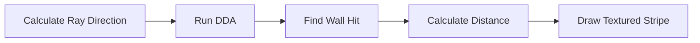

<p align="center">
  
  
  
</p>

<h1 align="center">🎮 Cub3D Raycasting Engine</h1>
<h3 align="center">Complete Technical Deep Dive</h3>

<p align="center">
  <i>A comprehensive guide to understanding the mathematics and implementation behind the raycasting engine</i>
</p>

---

## 📑 Table of Contents

| # | Section | Description |
|:-:|---------|-------------|
| 1 | [Overview & Architecture](#-1-overview--architecture) | Game loop and rendering pipeline |
| 2 | [Mathematical Foundation](#-2-the-mathematical-foundation) | Vectors, coordinates, rotations |
| 3 | [Player Representation](#-3-player-representation) | Camera plane and FOV |
| 4 | [Ray Casting Algorithm](#-4-ray-casting-algorithm) | Core raycasting logic |
| 5 | [DDA Algorithm](#-5-dda-algorithm) | Grid traversal |
| 6 | [Wall Rendering & Texturing](#-6-wall-rendering--texturing) | Texture mapping |
| 7 | [Door System](#-7-door-system) | Rotating door mechanics |
| 8 | [Sprite System](#-8-sprite-system) | Billboard sprites |
| 9 | [Z-Buffer & Occlusion](#-9-z-buffer--occlusion) | Depth handling |
| 10 | [Movement & Collision](#-10-movement--collision) | Physics and input |

---

## 🏗 1. Overview & Architecture

### What is Raycasting?

> **Raycasting** is a rendering technique that simulates a 3D environment by casting rays from the player's viewpoint into a 2D map.

Unlike true 3D engines that process polygons, raycasting exploits the constraint that **all walls are vertical** and the floor/ceiling are at fixed heights, allowing us to render each vertical strip of the screen independently.

<details>
<summary><b>📊 Click to expand: The Rendering Pipeline</b></summary>

```
┌─────────────────────────────────────────────────────────────────────┐
│                           GAME LOOP                                  │
├─────────────────────────────────────────────────────────────────────┤
│                                                                      │
│  1️⃣  Update Time (dt)                                               │
│  2️⃣  Process Input (keys, mouse)                                    │
│  3️⃣  Update Doors (animation)                                       │
│  4️⃣  Update Sprites (AI, animation)                                 │
│                                                                      │
│  5️⃣  For each screen column (x = 0 to WIDTH):                       │
│      ├── Calculate ray direction                                    │
│      ├── Run DDA to find wall/door hit                              │
│      ├── Calculate perpendicular distance                           │
│      ├── Calculate wall height on screen                            │
│      ├── Sample texture and draw vertical stripe                    │
│      └── Store distance in z-buffer                                 │
│                                                                      │
│  6️⃣  Render sprites (back-to-front, using z-buffer)                 │
│  7️⃣  Render minimap                                                 │
│  8️⃣  Put image to window                                            │
│                                                                      │
└─────────────────────────────────────────────────────────────────────┘
```

</details>

---

## 📐 2. The Mathematical Foundation

### 2.1 Coordinate System

The game uses a **2D grid coordinate system**:

| Axis | Direction | Description |
|:----:|:---------:|-------------|
| **X** | → Right | Increases East |
| **Y** | ↓ Down | Increases South |

Each grid cell is a **1×1 unit square**. Player position is a floating-point coordinate `(pos.x, pos.y)`.

```
      0     1     2     3     4    X→
    ┌─────┬─────┬─────┬─────┬─────┐
  0 │  1  │  1  │  1  │  1  │  1  │
    ├─────┼─────┼─────┼─────┼─────┤
  1 │  1  │  0  │  0  │  0  │  1  │
    ├─────┼─────┼─────┼─────┼─────┤
  2 │  1  │  0  │  P  │  0  │  1  │   ◄── P = Player at (2.5, 2.5)
    ├─────┼─────┼─────┼─────┼─────┤
  3 │  1  │  0  │  0  │  0  │  1  │
    ├─────┼─────┼─────┼─────┼─────┤
  4 │  1  │  1  │  1  │  1  │  1  │
    └─────┴─────┴─────┴─────┴─────┘
  Y↓
```

### 2.2 Vector Library

<details>
<summary><b>📦 Vector Structure Definition</b></summary>

```c
typedef struct s_vec2
{
    double x;
    double y;
} t_vec2;
```

</details>

#### Key Vector Operations

| Operation | Formula | Function | Purpose |
|:----------|:--------|:---------|:--------|
| ➕ **Addition** | `a + b = (aₓ + bₓ, aᵧ + bᵧ)` | `vec2_add(a, b)` | Translate positions |
| ➖ **Subtraction** | `a - b = (aₓ - bₓ, aᵧ - bᵧ)` | `vec2_sub(a, b)` | Get direction vectors |
| ✖️ **Scale** | `s · v = (s·vₓ, s·vᵧ)` | `vec2_scale(v, s)` | Movement speed |
| 🔘 **Dot Product** | `a · b = aₓbₓ + aᵧbᵧ` | `vec2_dot(a, b)` | Projection, angles |
| ❌ **Cross Product** | `a × b = aₓbᵧ - aᵧbₓ` | `vec2_cross(a, b)` | Ray-segment intersection |
| 📏 **Length** | `\|v\| = √(vₓ² + vᵧ²)` | `vec2_length(v)` | Distance calculation |
| 🔄 **Rotation** | See below | `vec2_rotate(v, θ)` | Camera/door rotation |

### 2.3 2D Rotation Matrix

To rotate a vector by angle **θ**:

```
┌      ┐   ┌                    ┐   ┌   ┐
│  x'  │   │  cos(θ)   -sin(θ)  │   │ x │
│      │ = │                    │ × │   │
│  y'  │   │  sin(θ)    cos(θ)  │   │ y │
└      ┘   └                    ┘   └   ┘
```

<details>
<summary><b>💻 Implementation Code</b></summary>

```c
t_vec2 vec2_rotate(t_vec2 v, double angle)
{
    double cos_a = cos(angle);
    double sin_a = sin(angle);
    return vec2(
        v.x * cos_a - v.y * sin_a,  // x' = x·cos(θ) - y·sin(θ)
        v.x * sin_a + v.y * cos_a   // y' = x·sin(θ) + y·cos(θ)
    );
}
```

</details>

> 💡 **Visual Impact**: This is used when rotating the player's view (keyboard arrows or mouse). Both the direction vector AND the camera plane must rotate together to maintain perspective.

---

## 👤 3. Player Representation

### 3.1 The Player Structure

```c
typedef struct s_player
{
    t_vec2  pos;           // Position in world coordinates
    t_vec2  dir;           // Direction vector (normalized, length ≈ 1)
    t_vec2  plane;         // Camera plane vector (perpendicular to dir)
    double  move_speed;    // Units per frame
    double  rot_speed;     // Radians per frame
} t_player;
```

### 3.2 The Camera Plane Concept

> 🔑 **Key Insight**: The player has both a **direction vector** (where looking) and a **camera plane** (defining the visible area).

```
                      Camera Plane (plane vector)
                      ←───────────────────────────→
                       ╲           │           ╱
                        ╲          │          ╱
                         ╲         │         ╱
           Left ray ──────╲       │       ╱────── Right ray
                           ╲      │dir   ╱
                            ╲     │     ╱
                             ╲    │    ╱
                              ╲   │   ╱
                               ╲  │  ╱
                                ╲ │ ╱
                                 ╲│╱
                                  P (Player position)
```

### 3.3 Field of View (FOV)

The **FOV** is determined by the ratio of plane length to direction length:

```
FOV = 2 × arctan(|plane| / |dir|)
```

| plane | dir | FOV |
|:-----:|:---:|:---:|
| 0.66 | 1.0 | ≈66° |
| 1.0 | 1.0 | 90° |
| 0.5 | 1.0 | ≈53° |

<details>
<summary><b>💻 Player Initialization Code</b></summary>

```c
void init_player(t_game_data *game_data, int row, int col, char orientation)
{
    game_data->player.pos = vec2(col + 0.5, row + 0.5);  // Center of tile
    game_data->player.dir = orientation_dir(orientation); // e.g., (0, -1) for 'N'
    game_data->player.plane = vec2_perpendicular(game_data->player.dir);
    game_data->player.plane = vec2_scale(game_data->player.plane, 0.66);
    game_data->player.move_speed = 0.05;
    game_data->player.rot_speed = 0.05;
}
```

</details>

> ❓ **Why 0.5 offset?** Places player at the **center** of the grid cell, not the corner.
> 
> ❓ **Why perpendicular plane?** The camera plane must be at 90° to the view direction to create proper perspective.

---

## 🎯 4. Ray Casting Algorithm

### 4.1 Overview

For each vertical column of pixels (`x = 0` to `WIDTH`):



### 4.2 Ray Direction Calculation

<details>
<summary><b>💻 Code Implementation</b></summary>

```c
void set_ray_dir(t_game_data *data)
{
    data->rc.ray_dir_x = data->player.dir.x + data->player.plane.x * data->rc.camera_x;
    data->rc.ray_dir_y = data->player.dir.y + data->player.plane.y * data->rc.camera_x;
}
```

</details>

#### The Math Behind It

For screen column `x` (0 to WIDTH-1):

```
camera_x = (2 × x / WIDTH) - 1
```

| Screen Position | camera_x | Description |
|:----------------|:--------:|:------------|
| `x = 0` | -1 | Left edge |
| `x = WIDTH/2` | 0 | Center |
| `x = WIDTH-1` | +1 | Right edge |

The ray direction is: **`ray = dir + plane × camera_x`**

```
camera_x = -1           camera_x = 0           camera_x = +1
     │                       │                      │
     ▼                       ▼                      ▼
←────●───────────────────────●──────────────────────●────→
    plane                   dir                   plane
    (-1)                    (0)                   (+1)
```

### 4.3 Delta Distance Calculation

**Delta Distance** = How far the ray travels to cross **one grid line**:

```
Δx = |1 / ray_dir_x|
Δy = |1 / ray_dir_y|
```

<details>
<summary><b>💻 Code Implementation</b></summary>

```c
void set_ray_dir_xy(t_game_data *data)
{
    if (data->rc.ray_dir_x)
        data->rc.delta_dist_x = fabs(1.0 / data->rc.ray_dir_x);
    else
        data->rc.delta_dist_x = 1e30;  // Infinity (ray parallel to Y-axis)
    
    if (data->rc.ray_dir_y)
        data->rc.delta_dist_y = fabs(1.0 / data->rc.ray_dir_y);
    else
        data->rc.delta_dist_y = 1e30;
}
```

</details>

---

## 🔍 5. DDA Algorithm

### 5.1 What is DDA?

> **DDA (Digital Differential Analyzer)** is an efficient algorithm to find which grid cells a ray passes through, checking each cell for walls.

Instead of testing every point along the ray, we "step" from grid line to grid line.

### 5.2 Step Direction

| Ray Direction | Step | Meaning |
|:--------------|:----:|:--------|
| `ray_dir_x < 0` | -1 | Going West |
| `ray_dir_x > 0` | +1 | Going East |
| `ray_dir_y < 0` | -1 | Going North |
| `ray_dir_y > 0` | +1 | Going South |

### 5.3 Initial Side Distance

The **side distance** is the distance from the player to the first grid line in each direction.

```
Player at (2.3, 1.7), ray going right (+X) and down (+Y):

        0       1       2       3       4
      ┌───────┬───────┬───────┬───────┬───────┐
    0 │       │       │       │       │       │
      ├───────┼───────┼───────┼───────┼───────┤
    1 │       │       │   P───┼───→   │       │  side_dist_x = (3 - 2.3) × δx
      ├───────┼───────┼───│───┼───────┼───────┤
    2 │       │       │   ↓   │       │       │  side_dist_y = (2 - 1.7) × δy
      └───────┴───────┴───────┴───────┴───────┘
```

### 5.4 The DDA Loop

<details>
<summary><b>💻 Core DDA Code</b></summary>

```c
void set_next_line(t_game_data *data)
{
    if (data->rc.side_dist_x < data->rc.side_dist_y)
    {
        data->rc.side_dist_x += data->rc.delta_dist_x;
        data->rc.map_x += data->rc.step_x;
        data->rc.side = 0;  // Hit vertical grid line (X-side)
    }
    else
    {
        data->rc.side_dist_y += data->rc.delta_dist_y;
        data->rc.map_y += data->rc.step_y;
        data->rc.side = 1;  // Hit horizontal grid line (Y-side)
    }
}
```

</details>

### 5.5 DDA Visualization

```
Step 1: side_dist_x < side_dist_y → move X
         P→──●      (hit vertical line at x=3)
              
Step 2: side_dist_x > side_dist_y → move Y
         P→────●    (hit horizontal line at y=2)
               │
               ↓
               
Step 3: side_dist_x < side_dist_y → move X
         P→────●    
               │
               └──●   (hit vertical line at x=4)
               
Step 4: ✅ Found wall at (4, 2)!
```

---

## 🧱 6. Wall Rendering & Texturing

### 6.1 Perpendicular Distance (Fisheye Correction)

> ⚠️ **Problem**: Using Euclidean distance makes walls appear curved like a fisheye lens!

```
❌ Euclidean Distance:              ✅ Perpendicular Distance:
                                    
     ╭───────────────────╮               ┌───────────────────┐
    ╱                     ╲              │                   │
   │                       │             │                   │
   │                       │             │                   │
    ╲                     ╱              │                   │
     ╰───────────────────╯               └───────────────────┘
    
   WRONG (fisheye effect)             CORRECT (flat walls)
```

<details>
<summary><b>💻 Distance Calculation Code</b></summary>

```c
void get_perp_wall_distance(t_game_data *data)
{
    if (data->rc.side == 0)  // Vertical wall (X-side)
    {
        data->rc.perp_wall_dist = (data->rc.map_x - data->player.pos.x 
            + (1 - data->rc.step_x) / 2.0) / data->rc.ray_dir_x;
    }
    else  // Horizontal wall (Y-side)
    {
        data->rc.perp_wall_dist = (data->rc.map_y - data->player.pos.y 
            + (1 - data->rc.step_y) / 2.0) / data->rc.ray_dir_y;
    }
}
```

</details>

### 6.2 Wall Height Calculation

If a wall is at distance **d**, its projected height on screen is:

```
h_screen = h_view / d
```

> 💡 **Visual Impact**: Closer walls → larger `line_height` → taller stripe on screen.

### 6.3 Drawing Boundaries

The wall is **centered vertically** on screen:

```
Screen (view_height = 600):

y = 0     ┌────────────────────────┐  ← Ceiling
          │▓▓▓▓▓▓▓▓▓▓▓▓▓▓▓▓▓▓▓▓▓▓▓▓│
y = 150   ├────────────────────────┤  ← draw_start (300 - 150)
          │░░░░░░░░ WALL ░░░░░░░░░░│
y = 300   │        CENTER          │  ← screen center
          │░░░░░░░░ WALL ░░░░░░░░░░│
y = 450   ├────────────────────────┤  ← draw_end (300 + 150)
          │▓▓▓▓▓▓▓▓▓▓▓▓▓▓▓▓▓▓▓▓▓▓▓▓│
y = 599   └────────────────────────┘  ← Floor
```

### 6.4 Texture Coordinate (wall_x)

**wall_x** is where the ray hit the wall as a fraction `[0, 1)`:

```
Wall texture (64×64 pixels):

  0.0       0.25       0.5       0.75       1.0
   │         │          │          │         │
   ▼         ▼          ▼          ▼         ▼
  ┌─────────┬──────────┬──────────┬─────────┐
  │   ░░░   │    ▓▓    │    ░░    │   ▓▓    │
  │   ░░░   │    ▓▓    │    ░░    │   ▓▓    │
  │   ░░░   │    ▓▓    │    ░░    │   ▓▓    │
  └─────────┴──────────┴──────────┴─────────┘
       0        16         32        48     63
```

If `wall_x = 0.375`, then `tex_x = 0.375 × 64 = 24`.

### 6.5 Texture Selection

| Side | Ray Direction | Texture |
|:----:|:-------------:|:-------:|
| 0 (X) | `ray_dir_x > 0` | 🌅 East |
| 0 (X) | `ray_dir_x < 0` | 🌄 West |
| 1 (Y) | `ray_dir_y > 0` | 🏔 South |
| 1 (Y) | `ray_dir_y < 0` | ❄️ North |

### 6.6 Texture Mapping Formula

```
tex_step = tex_height / line_height
```

| line_height | tex_height | tex_step | Effect |
|:-----------:|:----------:|:--------:|:-------|
| 300 | 64 | 0.21 | Each screen pixel = 0.21 texture pixels |
| 600 | 64 | 0.11 | Texture stretched more |
| 100 | 64 | 0.64 | Texture compressed |

---

## 🚪 7. Door System

### 7.1 Door Data Structure

```c
typedef struct s_door
{
    int             map_x;        // Grid X position
    int             map_y;        // Grid Y position
    double          progress;     // 0.0 = closed, 1.0 = open
    double          speed;        // Opening/closing speed
    t_door_state    state;        // CLOSED, OPENING, OPEN, CLOSING
    t_vec2          pivot;        // Hinge position
    t_vec2          span_closed;  // Door span when closed
    int             rot_sign;     // +1 or -1 (rotation direction)
    bool            has_geom;     // Geometry configured?
} t_door;
```

### 7.2 Door as a Rotating Segment

Unlike walls (axis-aligned grid lines), doors are **rotating line segments**:

```
🔒 Closed (progress = 0):           🔓 Open (progress = 1):

    ┌─────────────────┐                 ┌─────────────────┐
    │        │        │                 │        ╱        │
    │   P    │   D    │                 │   P   ╱    D    │
    │        │        │                 │      ╱          │
    │        │ ◄─span │                 │     ╱           │
    │        │        │                 │    ╱ ◄─ rotated │
    │        ◉ pivot  │                 │   ◉ pivot       │
    └─────────────────┘                 └─────────────────┘
```

### 7.3 Door Rotation Formula

As `progress` goes from 0 to 1, the door rotates 90° around its pivot:

```
span_current = rotate(span_closed, ±90° × progress)
```

### 7.4 Ray-Door Intersection

Using **Cramer's rule** with 2D cross product:

```
Given:
  Ray:  P + t·D     (origin P, direction D)
  Door: Q + s·S     (pivot Q, span S, s ∈ [0,1])

Solution:
  t = ((Q - P) × S) / (D × S)    ← distance along ray
  s = ((Q - P) × D) / (D × S)    ← position on door
```

> ⚠️ If `D × S = 0`, the lines are parallel (no intersection).

---

## 👾 8. Sprite System

### 8.1 Camera Space Transform

Sprites exist in **world space** but must be transformed to **camera space** for rendering.

```
┌─────────────────────────────────────────┐
│        CAMERA TRANSFORM MATRIX          │
├─────────────────────────────────────────┤
│                                         │
│   C = | plane_x   dir_x |               │
│       | plane_y   dir_y |               │
│                                         │
│   det(C) = plane_x·dir_y - dir_x·plane_y│
│                                         │
│   cam_x = (dir_y·rel_x - dir_x·rel_y)   │
│           ─────────────────────────     │
│                   det(C)                │
│                                         │
│   cam_z = (-plane_y·rel_x + plane_x·rel_y)│
│           ───────────────────────────   │
│                    det(C)               │
│                                         │
└─────────────────────────────────────────┘
```

| Result | Meaning |
|:-------|:--------|
| `cam_x > 0` | Sprite is to the right |
| `cam_x < 0` | Sprite is to the left |
| `cam_z > 0` | Sprite is in front ✅ |
| `cam_z < 0` | Sprite is behind ❌ |

### 8.2 Screen Projection

```
screen_x = (width / 2) × (1 + cam_x / cam_z)
sprite_size = view_height / cam_z
```

### 8.3 Sprite Depth Sorting

Sprites must be drawn **back-to-front** (painter's algorithm):

```
Distance:     FAR ─────────────────────→ NEAR
Draw order:    1st        2nd        3rd
               │          │          │
               ▼          ▼          ▼
            ┌─────┐    ┌─────┐    ┌─────┐
            │  A  │    │  B  │    │  C  │
            └─────┘    └─────┘    └─────┘
```

### 8.4 Z-Buffer Occlusion

```
Z-Buffer visualization:

Screen columns:      0     50    100    150    200    250
Z-Buffer (wall):   [5.0,  4.2,  3.1,   2.8,   3.5,   4.0]
                     │     │     │      │      │      │
Sprite at z=3.5:     ✅    ✅    ❌     ❌     ✅     ✅
                   drawn  drawn hidden hidden drawn  drawn
```

---

## 🕹 9. Z-Buffer & Occlusion

### 9.1 What is the Z-Buffer?

The **Z-buffer** (depth buffer) stores the distance to the nearest surface for each screen column.

| Purpose | Description |
|:--------|:------------|
| **Sprite occlusion** | Hide sprites behind walls |
| **Depth ordering** | Handle multiple sprites at different depths |

```c
// During raycasting, store wall distance:
data->z_buffer[x] = data->rc.perp_wall_dist;

// During sprite rendering, compare:
if (sprite->cam_z < data->z_buffer[x])
    draw_sprite_column();  // Sprite is in front
```

---

## 🏃 10. Movement & Collision

### 10.1 Rotation

> ⚠️ **Critical**: Both `dir` AND `plane` must rotate together. If only `dir` rotates, the FOV would distort!

```
Before rotation:              After rotating ONLY dir (WRONG):
                              
      plane                         plane
    ←───┼───→                     ←───┼───→
        │                              ╲
        │ dir                            ╲ dir
        ▼                                  ↘
        P                                   P
                              
    (90° angle)               (angle ≠ 90° - DISTORTED!)
```

### 10.2 Movement Vectors

| Movement | Vector | Formula |
|:---------|:-------|:--------|
| **Forward** | `dir` | `pos += dir × speed` |
| **Backward** | `-dir` | `pos -= dir × speed` |
| **Strafe Left** | `(dir_y, -dir_x)` | `pos += perp × speed` |
| **Strafe Right** | `(-dir_y, dir_x)` | `pos -= perp × speed` |

### 10.3 Wall Sliding Collision

When walking into a wall diagonally, **slide along it** instead of stopping:

```
Strategy:
  1. Try full movement (step_x, step_y)
  2. If blocked → try X-only movement  
  3. If still blocked → try Y-only movement

      ████████████████████  ← wall
           ↗
          P →→→→→→→         ← slides east along wall
```

### 10.4 Collision Detection with Radius

The player has a **collision radius** (0.2 units). We check 9 points:

```
Collision points checked:
       
     ●─────●─────●
     │           │
     ●     P     ●   ← Player with radius r
     │           │
     ●─────●─────●
     
All 9 points must be in valid (non-wall) cells
```

---

## 📋 Summary: Complete Rendering Pipeline

<details>
<summary><b>🔄 Click to expand: Full Frame Render Flowchart</b></summary>

```
1. FOR EACH FRAME:
   │
   ├── 🕐 Calculate delta time (dt)
   ├── 🚪 Update door animations
   ├── 👾 Update sprite AI and animations
   │
   ├── 🧱 FOR EACH SCREEN COLUMN (x = 0 to WIDTH):
   │   │
   │   ├── Calculate camera_x = (2 × x / WIDTH) - 1
   │   ├── Calculate ray_dir = dir + plane × camera_x
   │   ├── Initialize DDA
   │   │
   │   ├── 🔍 DDA LOOP:
   │   │   ├── Step to next grid line
   │   │   ├── Check if wall ('1') → break
   │   │   └── Check if door ('D') → intersection test
   │   │
   │   ├── Calculate perpendicular distance
   │   ├── Calculate wall height
   │   ├── Calculate texture coordinates
   │   │
   │   ├── 🎨 FOR EACH PIXEL IN COLUMN:
   │   │   ├── Sample color from texture
   │   │   └── Put pixel to framebuffer
   │   │
   │   ├── Draw ceiling
   │   ├── Draw floor
   │   └── Store distance in z_buffer[x]
   │
   ├── 👾 RENDER SPRITES:
   │   ├── Transform all sprites to camera space
   │   ├── Filter visible sprites (cam_z > 0)
   │   ├── Sort by distance (back to front)
   │   │
   │   └── FOR EACH SPRITE:
   │       ├── Calculate screen position and size
   │       └── FOR EACH SPRITE COLUMN:
   │           ├── Check z_buffer (skip if behind wall)
   │           └── Draw sprite pixels
   │
   ├── 🔫 Render gun overlay
   ├── 🗺️ Render minimap
   └── 🖼️ mlx_put_image_to_window()
```

</details>

---

## 📚 Key Formulas Reference

| Concept | Formula |
|:--------|:--------|
| Camera X | `camera_x = (2x / W) - 1` |
| Ray Direction | `ray = dir + plane × camera_x` |
| Delta Distance | `δ = \|1 / ray_component\|` |
| Perpendicular Dist | `d = (map - pos + offset) / ray` |
| Wall Height | `h = screen_height / distance` |
| Texture Step | `step = tex_height / wall_height` |
| 2D Rotation | `(x·cos θ - y·sin θ, x·sin θ + y·cos θ)` |
| Door Intersection | `t = (diff × span) / (dir × span)` |
| Camera Transform | `cam = C⁻¹ × relative_pos` |
| Sprite Screen X | `x = (W/2) × (1 + cam_x/cam_z)` |

---

## 📖 References & Further Reading

| Resource | Description |
|:---------|:------------|
| 🔗 [Lode's Raycasting Tutorial](https://lodev.org/cgtutor/raycasting.html) | The classic raycasting tutorial |
| 🔗 [Permadi's Tutorial](https://permadi.com/1996/05/ray-casting-tutorial-table-of-contents/) | Mathematical foundations |
| 📕 **Wolfenstein 3D Black Book** | Detailed engine analysis by Fabien Sanglard |
| 🔗 [GameDev Linear Algebra](https://www.gamedev.net/tutorials/programming/math-and-physics/) | Vector and matrix operations |

---

<p align="center">
  <i>Document created for cub3D project - December 2025</i>
</p>

<p align="center">
  Made with ❤️ at 42
</p>
